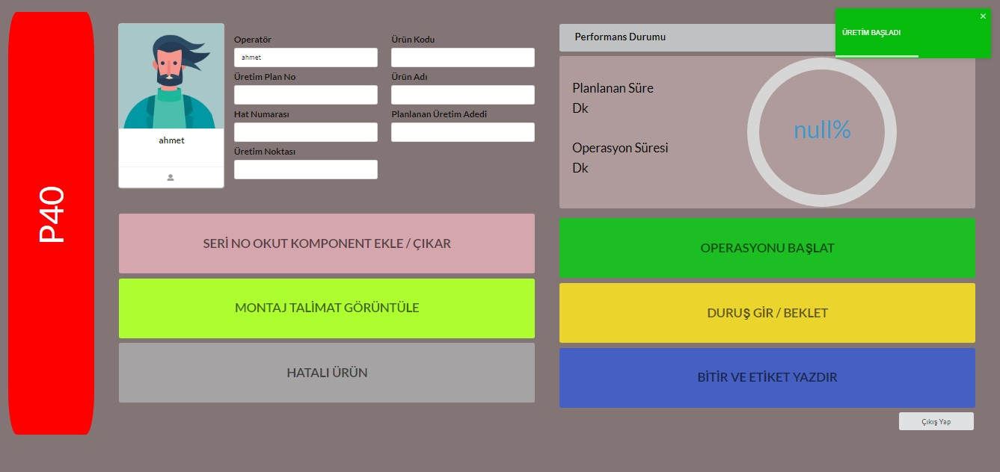
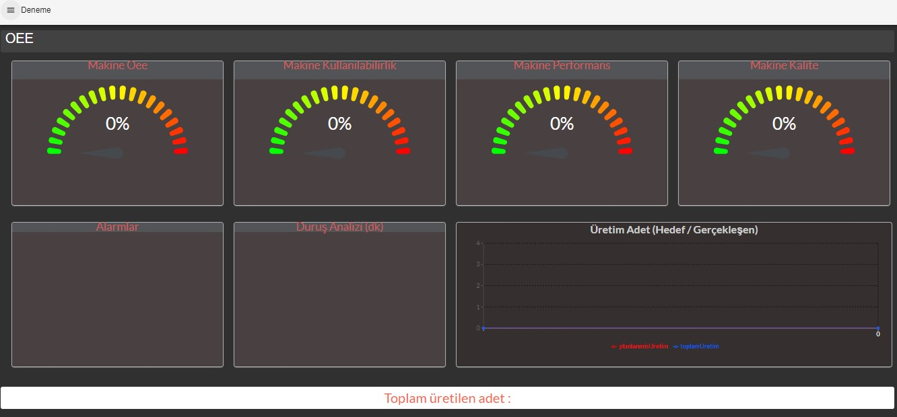

# OEE (Overall equipment effectiveness)

EN || Overall Equipment Effectiveness[1] (OEE) is a measure of how well a manufacturing operation is utilized (facilities, time and material) compared to its full potential, during the periods when it is scheduled to run. It identifies the percentage of manufacturing time that is truly productive. An OEE of 100% means that only good parts are produced (100% quality), at the maximum speed (100% performance), and without interruption (100% availability).

TR || Genel Ekipman Etkinliği, bir üretim işleminin, çalışması planlandığı dönemlerde, tam potansiyeline kıyasla ne kadar iyi kullanıldığının bir ölçüsüdür. Gerçekten üretken olan üretim süresinin yüzdesini tanımlar. %100 OEE, maksimum hızda ve kesintisiz olarak yalnızca iyi parçaların üretildiği anlamına gelir.

- To open the react app, 
  - go to"oeeoperator" folder; 
	run the file with "npm start" via vsCode.
  - at the same folder go to "backend" folder and run "node index.js" command.

- go back and find "oeeUretim" folder and run "node index.js" command.
- go back again and go to "oeeUretimYaz" folder. Then run "node uretimYaz.js" command.